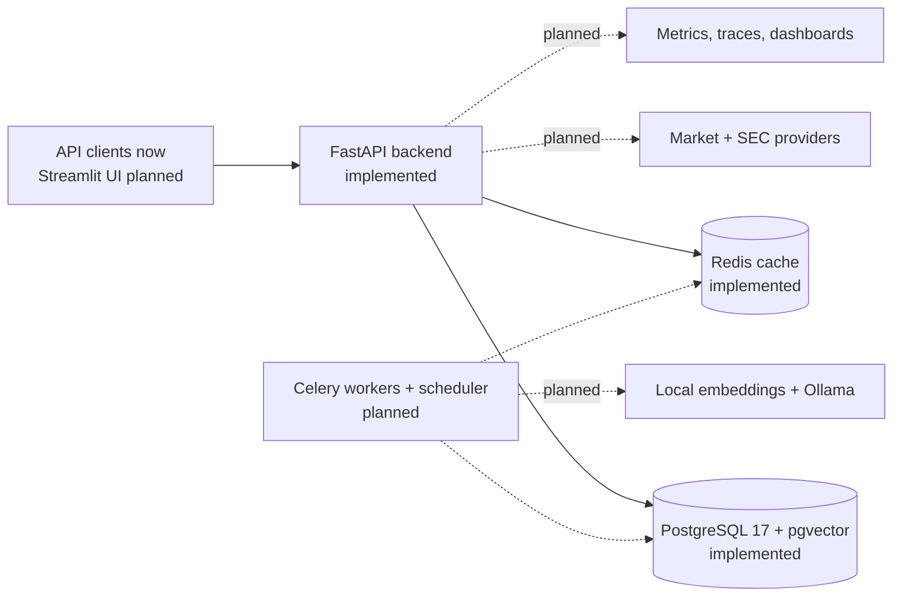

# AI Investment Research Co-Pilot

[](https://github.com/moazsarwar2004/ai-investment-research-copilot/actions/workflows/ci.yml)

AI Investment Research Co-Pilot is a source-backed research and education
platform for stocks, cryptocurrency, Binance markets, and SEC filings. The
project is designed for a small pilot of approximately 5-15 users and combines
deterministic analytics, evidence retrieval, explainable risk, asynchronous
reports, alerts, and operational monitoring in one modular system.

> **Current status:** Foundation release `0.2.0`. Phases 0, 1, and 2 are
> complete; Phase 3 (identity and authorization) is next. The repository is a
> tested platform foundation, not yet the finished research product.

This software is for research and education only. It does not execute trades,
store exchange trading keys, provide personalized financial advice, or promise
returns.

## Project goals

The completed product is intended to provide:

- Stock research with price history, technical indicators, SEC-derived
  fundamentals, filing comparisons, and explainable risk.
- SEC filing intelligence with evidence-first retrieval, hybrid vector/BM25
  search, resolvable citations, and explicit insufficient-evidence responses.
- General cryptocurrency research plus Binance Spot and Futures market
  analytics using public, read-only endpoints.
- Deterministic trend, anomaly, volatility, drawdown, liquidity, and risk
  calculations that remain usable without an LLM.
- Source-aware reports showing provider, timestamps, cache/freshness state,
  missing inputs, limitations, and a financial disclaimer.
- User-owned watchlists, alerts, saved reports, in-app notifications, and
  role-protected administration.
- Measured ML, local Ollama assistance, monitoring, backups, and portable
  production deployment only after their documented phase gates pass.

The project deliberately excludes automated trading, real-money order
execution, personalized recommendations, guaranteed signals, and unofficial
scraped finance endpoints.

## Current progress

| Workstream | Status | Result |
| --- | --- | --- |
| Phase 0 - Production plan | Complete | Requirements, architecture, data model, APIs, provider constraints, risks, and 21-phase delivery plan |
| Phase 1 - API foundation | Complete | FastAPI application factory, validated settings, structured logging, request IDs, security middleware, errors, health endpoints, and tests |
| Phase 2 - Durable infrastructure | Complete | PostgreSQL/pgvector, Redis, async SQLAlchemy, Alembic, cache primitives, lifecycle management, readiness policy, and real-service tests |
| Continuous integration | Complete | Automated quality and PostgreSQL/Redis integration jobs on pushes and pull requests |
| Phase 3 - Identity and authorization | Next | Users, sessions, token rotation, password security, RBAC, ownership, rate limits, and audit records |
| Phases 4-20 | Planned | Providers, research modules, analytics, ML, RAG, reports, alerts, frontend, observability, hardening, and deployment |

Three of the 21 planned delivery phases are complete. Detailed exit gates are in
[`docs/milestones.md`](docs/milestones.md).

## Architecture

The target is a modular monolith: one Python codebase with clear internal
boundaries, deployed as separate API, worker, and scheduler processes when those
phases are implemented.



PostgreSQL is the durable system of record. Redis is disposable acceleration;
losing Redis must not lose user-owned data. Deterministic analytics remain the
correctness layer, while ML and local LLM features must degrade to documented
fallbacks.

## Technology stack

| Area | Technology | Status |
| --- | --- | --- |
| Language and API | Python 3.12, FastAPI, Uvicorn | Implemented |
| Validation and settings | Pydantic, pydantic-settings | Implemented |
| Database | PostgreSQL 17, pgvector, async SQLAlchemy, asyncpg | Implemented |
| Migrations | Alembic | Implemented |
| Cache | Redis with versioned JSON envelopes and soft/hard TTL | Implemented |
| Local infrastructure | Docker Desktop and Docker Compose | Implemented |
| Testing and quality | pytest, pytest-asyncio, Ruff, Black, MyPy | Implemented |
| Automation | GitHub Actions | Implemented |
| Frontend | Streamlit | Planned |
| Background work | Celery workers and scheduler | Planned |
| Research and AI | Provider adapters, deterministic analytics, scikit-learn, pgvector/BM25 RAG, Ollama | Planned by phase |
| Production operations | Caddy, OpenTelemetry, Grafana Cloud, uptime checks, encrypted backups | Planned by phase |

## Implemented today

- Strict FastAPI application configuration with development, testing, staging,
  and production modes.
- Structured JSON logging, request correlation IDs, bounded public error
  responses, CORS validation, and browser security headers.
- Liveness and dependency-aware readiness endpoints.
- PostgreSQL/pgvector and Redis with pinned container images, loopback-only host
  ports, health checks, and persistent named volumes.
- Separate migration and runtime database roles for local development.
- Async database sessions, bounded connection pools, independent readiness
  probes, and clean shutdown handling.
- Redis cache keys, schema-versioned values, freshness metadata, soft/hard TTL,
  corrupt-entry eviction, and safe cache bypass during Redis outages.
- Alembic migration `20260715_0001`, which enables pgvector.
- Unit, API, failure-mode, and real infrastructure integration tests.
- GitHub CI for formatting, linting, types, tests, Compose validation, migrations,
  and real PostgreSQL/Redis verification.

Authentication, provider integrations, market research screens, analytics, ML,
RAG, reports, alerts, and deployment are intentionally not implemented yet.

## Repository structure

```text
.
|-- .github/workflows/       GitHub Actions CI
|-- alembic/                 Database migration environment and revisions
|-- backend/app/
|   |-- api/                 HTTP routes
|   |-- cache/               Redis cache contracts
|   |-- core/                Configuration, logging, errors, security, lifecycle
|   |-- database/            Async SQLAlchemy engine and sessions
|   |-- middleware/          Request ID, logging, and security headers
|   `-- tests/               Unit, API, and infrastructure tests
|-- docs/                    Requirements, architecture, roadmap, and phase evidence
|-- infrastructure/          Container initialization scripts
|-- compose.yaml             Local PostgreSQL/pgvector and Redis services
|-- pyproject.toml           Package and tool configuration
`-- requirements*.txt        Runtime and development dependencies
```

## Quick start

### Prerequisites

- Windows PowerShell
- Python 3.12
- Docker Desktop with Linux containers and Compose v2
- Git

### 1. Create the Python environment

Run from the repository root:

```powershell
py -3.12 -m venv .venv
.\.venv\Scripts\Activate.ps1
python -m pip install --upgrade pip setuptools wheel
python -m pip install -r requirements-dev.txt
Copy-Item .env.example .env
```

If activation is blocked, allow it only for the current PowerShell process:

```powershell
Set-ExecutionPolicy -Scope Process -ExecutionPolicy Bypass
.\.venv\Scripts\Activate.ps1
```

The committed `.env.example` contains documented local-only defaults. A real
`.env` is ignored by Git. Replace every credential before any shared or
internet-facing deployment.

### 2. Start and migrate the infrastructure

```powershell
docker compose up -d --wait
docker compose ps
python -m alembic upgrade head
```

`docker compose down` stops the services without deleting their named volumes.
Do not add `-v` unless you intentionally want to erase the local database and
cache volumes.

### 3. Run the API

```powershell
python -m uvicorn backend.app.main:app --reload
```

Open:

- API information: `http://127.0.0.1:8000/`
- Swagger UI: `http://127.0.0.1:8000/docs`
- Liveness: `http://127.0.0.1:8000/livez`
- Readiness: `http://127.0.0.1:8000/readyz`
- Versioned health: `http://127.0.0.1:8000/api/v1/health`

`/livez` never calls external dependencies. `/readyz` returns HTTP 503 when
PostgreSQL is unavailable, while a Redis-only failure remains HTTP 200 with
`redis: degraded` because cache acceleration is disposable.

## Testing

Run the fast local quality gates:

```powershell
python -m ruff check .
python -m black --check .
python -m mypy backend
python -m pytest -m "not integration"
python -m pip check
python -m alembic upgrade head --sql
docker compose config --quiet
```

After Compose is healthy and the migration is applied, run the real
infrastructure test:

```powershell
$env:RUN_INFRASTRUCTURE_TESTS = '1'
python -m pytest -m integration
Remove-Item Env:RUN_INFRASTRUCTURE_TESTS
```

The integration test verifies PostgreSQL and Redis connectivity, the pgvector
extension, Alembic revision `20260715_0001`, and a Redis write/read/delete round
trip.

## Continuous integration

The [`CI` workflow](.github/workflows/ci.yml) runs for pull requests to `main`,
pushes to `main`, and manual dispatches. It contains two sequential jobs:

1. `Quality` checks dependencies, Compose, Ruff, Black, MyPy, unit/API tests, and
   offline Alembic SQL.
2. `Infrastructure integration` starts PostgreSQL/pgvector and Redis, applies the
   migration, runs the real integration test, and removes its temporary volumes.

The workflow has read-only repository permissions, uses immutable action SHAs,
requires no GitHub secrets, and does not deploy the application.

## Configuration

The full local configuration template is [`.env.example`](.env.example). Main
groups include:

| Group | Purpose |
| --- | --- |
| `APP_*`, `ENVIRONMENT`, `DEBUG` | Service identity and runtime mode |
| `LOG_*` | Logging level and JSON/console format |
| `ALLOWED_ORIGINS`, `ENABLE_HSTS` | Browser and transport security policy |
| `DATABASE_URL`, `MIGRATION_DATABASE_URL` | Separate runtime and migration connections |
| `DATABASE_*` | Connection, command, probe, pool, and recycle limits |
| `REDIS_URL`, `REDIS_KEY_PREFIX`, `REDIS_*` | Cache connection, namespace, and bounded timeouts |

Infrastructure URLs use secret-aware settings fields so normal settings
representations do not expose their credentials.

## Documentation

| Document | Purpose |
| --- | --- |
| [`requirements.md`](docs/requirements.md) | Product scope, roles, features, safety, reliability, and acceptance requirements |
| [`architecture.md`](docs/architecture.md) | Runtime design, trust boundaries, deployment topology, and fallbacks |
| [`database_design.md`](docs/database_design.md) | Target data model, constraints, ownership, and retention |
| [`api_docs.md`](docs/api_docs.md) | Planned versioned API surface and response contracts |
| [`data_sources.md`](docs/data_sources.md) | Provider purpose, caching, attribution, licensing, and failure policy |
| [`risk_register.md`](docs/risk_register.md) | Technical, security, legal, and operational risks |
| [`milestones.md`](docs/milestones.md) | All 21 phases and their exit gates |
| [`phase_0_plan.md`](docs/phase_0_plan.md) | Approved planning baseline |
| [`phase_1_foundation.md`](docs/phase_1_foundation.md) | FastAPI foundation implementation and validation |
| [`phase_2_infrastructure.md`](docs/phase_2_infrastructure.md) | Durable infrastructure design, commands, failure tests, and evidence |

## Roadmap overview

| Milestone | Phases | Outcome |
| --- | ---: | --- |
| Approved design | 0 | Buildable requirements and architecture |
| Secure platform core | 1-4 | API, infrastructure, identity, authorization, and provider resilience |
| Deterministic research MVP | 5-10 | Binance, crypto, stocks/SEC, and reproducible analytics |
| ML, RAG, and reports | 11-15 | Measured models, evidence-first retrieval, guarded local LLM, and reports |
| Multi-user product and operations | 16-19 | Watchlists, alerts, frontend, observability, security, and recovery |
| Production pilot | 20 | Portable HTTPS deployment, immutable delivery, monitoring, and rollback |

Later phases do not begin until the current phase's tests and documented exit
evidence pass.

## Responsible-use boundary

- Research and educational use only; not personalized financial advice.
- No order placement, withdrawals, exchange-secret storage, or automated trading.
- No claim of guaranteed accuracy, performance, availability, or returns.
- Provider data must retain source attribution, timestamps, freshness, cache
  state, missing-data warnings, and licensing constraints.
- LLM output can summarize verified inputs but cannot calculate authoritative
  risk or invent evidence.
- Internet-facing deployment requires replacing local credentials and completing
  the later security, backup, observability, and production gates.
