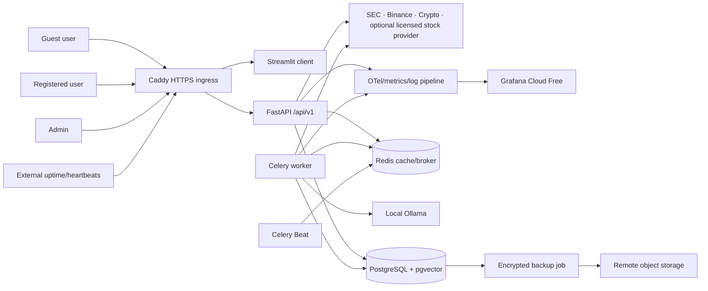
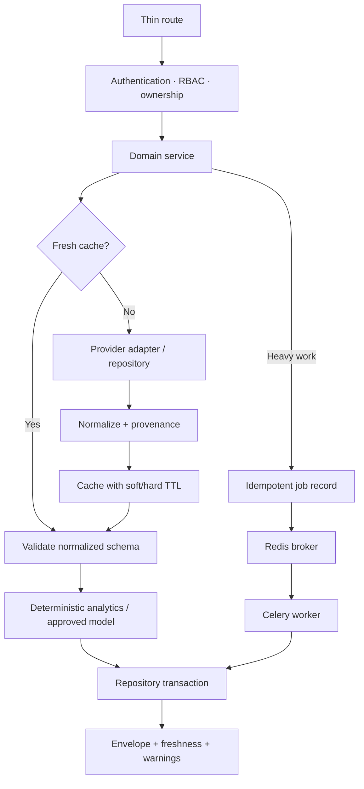
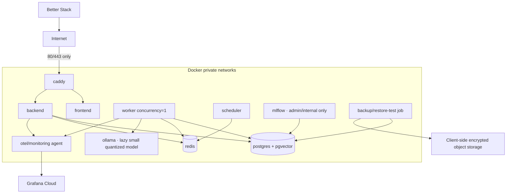
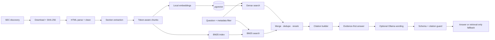

# Architecture

## 1. Chosen style

The system is a modular monolith deployed as cooperating containers. One backend codebase owns domain rules and exposes versioned APIs. The worker and scheduler import the same services but run outside request processes. This keeps deployment suitable for one low-cost VM without coupling the UI to business logic.

## 2. System context

## 3. Request and job flow

Routes do not contain calculations, provider mapping or SQL. Repositories perform database access only. Provider adapters never return raw external payloads beyond their boundary.

## 4. Backend module boundaries

| Module | Owns | Must not own |
|---|---|---|
| `api` | HTTP parsing, dependencies, status codes, response schemas | Business calculations, SQL, raw provider parsing |
| `services` | Use cases, authorization decisions, partial-response policy | Vendor-specific wire formats |
| `repositories` | SQLAlchemy queries and transactions | Business scoring or HTTP calls |
| `providers` | HTTP client, normalization, quota/terms metadata | User authorization or UI formatting |
| `analytics` | Indicators, ratios, risk, trends, anomalies | Provider I/O or LLM wording |
| `ml` | Features, training, registry, inference, fallbacks | Exact-price promises |
| `rag` | Filing parse/chunk/embed/retrieve/rerank/cite | Treating retrieved text as instructions |
| `llm` | Prompt registry, Ollama call, schema/citation guard, fallback | Price/risk computation |
| `workers` | Task orchestration, retries, heartbeat | Duplicated domain logic |
| `monitoring` | Metrics, traces, structured events, drift/RAG/LLM quality | Secrets or raw credentials |

## 5. Production container topology

Only Caddy publishes host ports. `/api/v1/system/status`, `/livez` and a deliberately reduced `/readyz` may be routed publicly. `/metrics`, provider diagnostics, MLflow and admin internals are blocked by Caddy and network policy.

## 6. Network and trust boundaries

| Boundary | Controls |
|---|---|
| Browser → Caddy | TLS, HSTS after first successful issuance, body limits, request ID, security headers |
| Caddy → frontend/backend | Private Docker network, no direct host publication |
| API → providers | Outbound host allowlist, TLS verification, timeouts, quota tracking, redacted logs |
| API/worker → PostgreSQL | Least-privilege application role; separate migration and backup roles |
| API/worker → Redis | Private network, password/ACL where supported, key prefixes, no source-of-truth data |
| Worker → Ollama | Structured verified input only, context cap, schema and citation validation |
| Telemetry → cloud | No tokens, passwords, filings with user annotations or raw prompt contents |
| Backup → object storage | `pg_dump` + compression + client-side `age` encryption; checksum and heartbeat |

## 7. Authentication design

- Access token lifetime target: 15 minutes.
- Refresh token lifetime target: 7 days, rotated on every use; 30-day absolute family lifetime.
- Persist only an HMAC/SHA-256 token digest, family ID, expiry, revocation and client metadata.
- A replayed refresh token revokes the full family and creates an audit event.
- Streamlit holds tokens only in server-side per-session memory; it does not write them to browser local storage or logs. Reconnect without a valid server session requires login again.
- The API remains the authorization authority. Every user-owned query includes `user_id` in its predicate.
- Admin operations require an admin role and fresh authentication; TOTP is a recommended hardening item before internet exposure.

## 8. Cache and provider resilience

Cache keys are versioned and include provider, operation, normalized asset, interval and relevant parameters. A distributed lock prevents cache stampedes. Provider calls use a total deadline, bounded retries for safe idempotent requests, jitter, `Retry-After`, per-provider circuit breakers and quota gauges.

When a provider fails, the response policy is:

1. Return a still-valid cache hit.
2. Return permitted stale data with its original timestamp and a warning.
3. Return a partial response with unavailable fields.
4. Return a typed `503 provider_unavailable` only if the requested result has no responsible fallback.

## 9. RAG and report architecture

Filings are immutable by content hash. The prompt places filing text inside a quoted data field and explicitly says it is untrusted. The final citation builder accepts only chunk IDs returned by retrieval.

## 10. Single-VM sizing assumptions

Oracle's verified allowance is currently 2 OCPUs and 12 GB RAM. That is workable only with conservative concurrency and bounded models:

| Workload | Initial control |
|---|---|
| API | 2 worker processes maximum after load test; start with 1 on 2 OCPUs |
| Celery | concurrency 1; separate queues for interactive reports and scheduled ingestion |
| PostgreSQL | conservative connection pool; pgvector indexes sized after corpus measurement |
| Redis | `maxmemory` and eviction limited to cache keys; broker/result keys protected by policy |
| Ollama | one small quantized instruct model loaded on demand; one generation at a time |
| Embeddings | small CPU model, batch in worker, never in an API request process |
| MLflow | internal service; stop outside training/admin windows if memory pressure requires it |
| Telemetry | sampling and low-cardinality labels; never asset/user IDs as metric labels |

An account-level load test must demonstrate acceptable memory headroom during simultaneous API, worker, database and Ollama activity. If not, Ollama moves to a separate user-owned machine or remains disabled with template fallback.

## 11. Data lifecycle

- User, audit and alert/report metadata are retained until account deletion or an explicit policy period.
- Raw market snapshots are aggregated/expired according to a documented retention job; derived reports retain source references.
- Filing HTML/text and embeddings are content-addressed and retained while referenced.
- Job results and agent logs have bounded retention; sanitized failure summaries remain for operational analysis.
- Deleted user-owned resources use explicit hard-delete/anonymization jobs and audit tombstones without preserving private content.

## 12. Deployment and rollback

CI builds immutable ARM64-compatible images and publishes commit-SHA/version tags. Production deployment pulls the exact release, runs backward-compatible Alembic migrations, starts services, checks liveness/readiness and performs a smoke query. On failure, Compose returns to the last known application tags. Destructive migrations require a two-release expand/migrate/contract sequence; image rollback is not presented as database rollback.

## 13. Architecture validation result

The modular-monolith design is appropriate for the stated traffic and avoids unnecessary distributed systems. The principal feasibility constraints are external: stock display licensing, Oracle capacity/idle reclamation, and CPU-only LLM latency. Each has a non-destructive feature fallback and a milestone gate.

