# Database Design and ERD

## 1. Conventions

- PostgreSQL with the `vector` extension is the durable system of record.
- User-facing IDs are UUIDs generated by the application or database. Internal high-volume rows may use `bigint` while retaining a public UUID where exposed.
- All timestamps are timezone-aware UTC (`timestamptz`).
- Prices and monetary values use `numeric`, never binary floating point. Analytics arrays/features may use floating point when their precision contract permits it.
- Flexible provider/model metadata uses JSONB with a documented schema and validation at the service boundary.
- Every foreign key states its delete behavior. User-owned children generally cascade; immutable operational/audit evidence is anonymized or restricted instead of silently cascaded.
- Migrations are Alembic-only. Production roles cannot issue ad hoc DDL.

## 2. Logical ERD

```mermaid
erDiagram
    USERS ||--o{ USER_SESSIONS : owns
    USERS ||--o{ WATCHLISTS : owns
    WATCHLISTS ||--o{ WATCHLIST_ITEMS : contains
    USERS ||--o{ ALERTS : owns
    ALERTS ||--o{ ALERT_EVENTS : emits
    USERS ||--o{ RESEARCH_REPORTS : requests
    USERS ||--o{ AUDIT_LOGS : acts
    USERS ||--o{ NOTIFICATIONS : receives
    FILINGS ||--o{ FILING_CHUNKS : contains
    FILINGS ||--o{ FILING_COMPARISONS : compared_as_latest
    FILINGS ||--o{ FILING_COMPARISONS : compared_as_previous
    JOBS ||--o{ AGENT_RUNS : contains
    JOBS o|--o| RESEARCH_REPORTS : produces
    MODEL_REGISTRY ||--o{ RISK_SNAPSHOTS : versions
    MODEL_REGISTRY ||--o{ RESEARCH_REPORTS : informs
    PROMPT_REGISTRY ||--o{ RESEARCH_REPORTS : formats
    RESEARCH_REPORTS ||--o{ RAG_FEEDBACK : receives

    USERS {
        uuid id PK
        citext email UK
        text password_hash
        text role
        text status
        timestamptz created_at
        timestamptz updated_at
    }
    USER_SESSIONS {
        uuid id PK
        uuid user_id FK
        uuid token_family_id
        text refresh_token_digest UK
        timestamptz expires_at
        timestamptz revoked_at
    }
    WATCHLISTS {
        uuid id PK
        uuid user_id FK
        text name
        timestamptz created_at
    }
    WATCHLIST_ITEMS {
        uuid id PK
        uuid watchlist_id FK
        text asset_type
        text asset_key
        jsonb metadata
    }
    ALERTS {
        uuid id PK
        uuid user_id FK
        text alert_type
        text asset_type
        text asset_key
        numeric threshold
        interval cooldown
        boolean enabled
    }
    ALERT_EVENTS {
        uuid id PK
        uuid alert_id FK
        text event_fingerprint UK
        numeric observed_value
        timestamptz triggered_at
        text delivery_status
    }
    MARKET_SNAPSHOTS {
        bigint id PK
        uuid public_id UK
        text provider
        text asset_type
        text asset_key
        timestamptz source_timestamp
        jsonb payload
    }
    FILINGS {
        uuid id PK
        text cik
        text accession_number UK
        text form_type
        date filing_date
        text source_url
        text content_hash UK
    }
    FILING_CHUNKS {
        bigint id PK
        uuid public_id UK
        uuid filing_id FK
        text section
        integer chunk_index
        text content
        vector embedding
        tsvector search_document
    }
    FILING_COMPARISONS {
        uuid id PK
        uuid latest_filing_id FK
        uuid previous_filing_id FK
        text methodology_version
        jsonb changes
    }
    RISK_SNAPSHOTS {
        uuid id PK
        text asset_type
        text asset_key
        numeric overall_score
        text risk_label
        text methodology_version
        uuid model_registry_id FK
        jsonb components
    }
    RESEARCH_REPORTS {
        uuid id PK
        uuid user_id FK
        uuid job_id FK
        text asset_type
        text asset_key
        text generation_mode
        text status
        jsonb report
        jsonb source_manifest
    }
    JOBS {
        uuid id PK
        uuid requested_by FK
        text job_type
        text status
        text idempotency_key
        integer attempt_count
        timestamptz available_at
    }
    AGENT_RUNS {
        uuid id PK
        uuid job_id FK
        text agent_name
        text status
        text model_version
        text prompt_version
        text error_code
    }
    AUDIT_LOGS {
        bigint id PK
        uuid public_id UK
        uuid actor_user_id FK
        text action
        text resource_type
        uuid resource_id
        jsonb details
        timestamptz created_at
    }
    MODEL_REGISTRY {
        uuid id PK
        text model_name
        text model_version
        text status
        text artifact_uri
        jsonb metrics
        jsonb feature_schema
    }
    PROMPT_REGISTRY {
        uuid id PK
        text prompt_name
        text prompt_version
        text content_hash UK
        boolean active
    }
    RAG_FEEDBACK {
        uuid id PK
        uuid report_id FK
        uuid user_id FK
        smallint rating
        jsonb cited_chunk_ids
    }
    NOTIFICATIONS {
        uuid id PK
        uuid user_id FK
        uuid alert_event_id FK
        text channel
        text status
        timestamptz read_at
    }
```



## 3. Table contracts

### 3.1 Identity and user data

| Table | Required fields/constraints | Important indexes |
|---|---|---|
| `users` | UUID PK; case-insensitive unique email; Argon2 hash; `role IN ('user','admin')`; status; verification/reset digest and expiries; UTC timestamps | unique lower/email, status, created_at |
| `user_sessions` | user FK; unique refresh digest; family UUID; expiry/revocation; rotation parent; last-used time; sanitized client/IP hash | user+active, family_id, expires_at |
| `watchlists` | user FK cascade; name; `UNIQUE(user_id, lower(name))` | user_id |
| `watchlist_items` | watchlist FK cascade; asset type/key; optional provider ID; `UNIQUE(watchlist_id, asset_type, asset_key)` | watchlist_id, asset lookup |
| `notifications` | user FK cascade; optional alert event; channel/status; payload; read time | user+read_at, created_at |

Passwords, raw tokens and provider secrets never appear in metadata JSON.

### 3.2 Alerts

| Table | Required fields/constraints | Important indexes |
|---|---|---|
| `alerts` | owner; asset; supported alert type; operator; numeric threshold or JSON rule; cooldown > 0; enabled; last evaluated/triggered | enabled+next evaluation, owner, asset |
| `alert_events` | alert FK cascade; globally unique deterministic fingerprint; observed value; source snapshot reference/metadata; delivery state | alert+triggered_at desc, delivery status |

The event fingerprint is a hash of alert ID, condition version and evaluation bucket. A unique constraint enforces duplicate prevention under concurrent workers.

### 3.3 Market, filing and RAG data

| Table | Required fields/constraints | Important indexes |
|---|---|---|
| `market_snapshots` | provider, asset type/key, source/fetch timestamps, freshness, normalized payload, content hash | asset+source time desc, provider+fetch time, BRIN on fetch time |
| `filings` | CIK, company/ticker, form, filing date, accession, source URL, content hash, parse status | unique accession; unique content hash; CIK+form+date desc |
| `filing_chunks` | filing FK cascade; section, index, content, token count, source anchors, embedding version/vector, lexical document | unique filing+section+chunk; HNSW/IVFFlat vector after benchmark; GIN lexical; metadata filters |
| `filing_comparisons` | ordered pair of filing FKs; version; added/removed/changed evidence and confidence | unique latest+previous+version |

Vector dimension is set by the selected embedding model and frozen in its migration/configuration. Changing dimensions creates a new column/table/index version and a controlled re-embedding job.

### 3.4 Analytics, reports and ML/LLM operations

| Table | Required fields/constraints | Important indexes |
|---|---|---|
| `risk_snapshots` | asset, method version, score 0–100, label, components/weights, confidence 0–1, missing inputs, source manifest | asset+calculated_at desc, method version |
| `research_reports` | nullable owner for guest ephemeral reports; asset; status; generation mode; structured report; source manifest; model/prompt versions; content hash | owner+created desc, asset+created desc, status |
| `model_registry` | unique name+version; dataset/feature versions; metrics; artifact checksum/URI; active/retired status; drift | partial unique active per model name, status |
| `prompt_registry` | unique prompt name+version and content hash; schema version; active flag | partial unique active per prompt name |
| `rag_feedback` | user/report or answer reference; rating bounds; optional reason; cited chunk IDs | report, created_at |

Activation of a model or prompt is an audited transaction. A database row points to an artifact whose checksum is verified before loading; MLflow is experiment/artifact metadata, not the authorization source for production activation.

### 3.5 Operations

| Table | Required fields/constraints | Important indexes |
|---|---|---|
| `jobs` | request owner; type/status; idempotency key; payload/result metadata; attempts; schedule/start/end; sanitized error | unique owner+type+idempotency key; status+available_at; created_at |
| `agent_runs` | job/workflow; agent/asset/status/times/provider/cache/retries/model/prompt/error | job, status+started_at, agent+started_at |
| `audit_logs` | append-only actor/action/resource/request/IP hash/details/timestamp | actor+created, action+created, resource lookup, BRIN created_at |
| `provider_usage` | provider/endpoint/status/weight/quota window/latency/cache/request time | provider+window, status+time |
| `feature_flags` | unique key; enabled; scope; JSON config; version; updated_by | unique key, enabled |

Audit rows never contain authentication material or full provider payloads. Mutating audit rows is denied to the application role.

## 4. Ownership query rule

Repositories for user-owned resources never fetch by object ID alone. The minimum predicate is:

```sql
WHERE id = :resource_id AND user_id = :authenticated_user_id
```

Admin access uses a separate audited service path; it does not bypass ownership by omitting the predicate in a shared repository method.

## 5. Retention and partitioning

- Start without partitions except where migration tests prove they are useful. Low traffic does not justify early partition complexity.
- Consider monthly partitioning/BRIN for `market_snapshots`, `audit_logs`, `provider_usage` and `agent_runs` only after measured growth.
- Expire high-frequency market snapshots after producing required aggregates; preserve source manifests used by saved reports.
- Keep audit security events for at least 365 days unless privacy policy requires earlier anonymization.
- Keep job/agent success detail for 90 days and failure summaries for 365 days; make values configurable.
- Embeddings and parsed filings are content-addressed and retained while referenced.

## 6. Migration strategy

1. Alembic creates extensions and base schema using the migration role.
2. CI applies every migration to an empty database and upgrades a previous-release fixture.
3. Production uses expand/migrate/contract for breaking changes.
4. A release can roll application images back one version while the expanded schema remains compatible.
5. Backup and restore are tested before destructive contract migrations.

