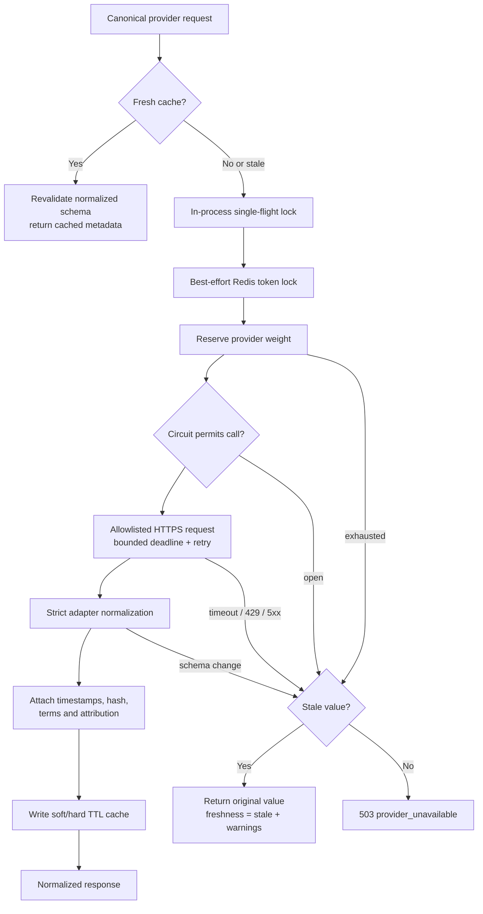

# Phase 4 — Provider Framework

## 1. Outcome

Phase 4 completes the secure platform core with reusable, provider-neutral
plumbing. It deliberately does not call Binance, CoinGecko, SEC, or a stock
provider. Concrete market-data adapters begin in Phase 5, after this framework's
failure behavior is proven entirely with mocks.

Implemented:

- A lifecycle-owned pooled `httpx.AsyncClient` for async provider reads.
- Per-attempt connect/read/write/pool timeouts plus one total request deadline.
- Bounded retries for safe `GET`/`HEAD` calls with exponential jitter.
- `Retry-After` handling for both delta-seconds and HTTP-date values.
- Exact HTTPS host allowlists, redirect refusal, credential/fragment rejection,
  bounded response sizes, and query-free provenance URLs.
- Abstract adapters that own request mapping, vendor schema validation,
  normalization, usage-header extraction, attribution, and terms metadata.
- Decimal-safe normalized Pydantic contracts with canonical asset identity,
  UTC timestamps, structured warnings, raw-payload SHA-256, schema version,
  provider request ID, source URL, delay class, and terms-review version.
- Per-provider weight budgets with interactive capacity reserved from scheduled
  work and authoritative usage-header reconciliation.
- Per-provider circuit breakers with closed/open/half-open states and one
  guarded recovery probe.
- Versioned soft/hard-TTL caching, token-owned Redis locks, in-process
  single-flight locking, bounded cross-process refresh waiting, and explicit
  cache-bypass behavior when Redis is unavailable.
- Stale fallback that preserves the original source/fetch timestamps and adds
  stable `stale_cache_fallback` plus provider-failure warnings.
- A safe `503 provider_unavailable` application error when no responsible
  cache fallback exists.

## 2. Module boundaries

| Module | Responsibility |
| --- | --- |
| `providers/models.py` | Canonical request, normalized payload, provenance, freshness, and response contracts |
| `providers/adapters.py` | Abstract adapter boundary; vendor fields never escape it |
| `providers/http_client.py` | Outbound security, deadlines, retries, `Retry-After`, response hashing |
| `providers/quota.py` | Local proactive weight budgets and provider usage reconciliation |
| `providers/circuit_breaker.py` | Per-provider failure isolation and recovery probes |
| `providers/manager.py` | Cache-first orchestration, single flight, normalization, stale fallback |
| `cache/redis_cache.py` | Soft/hard TTL envelopes and token-owned distributed locks |

The framework stores only normalized JSON in cache. Raw provider payloads are
hashed for provenance and discarded after adapter normalization.

## 3. Request and fallback flow



## 4. Invariants

- Only `GET` and `HEAD` are supported by the generic outbound contract.
- Every adapter has a non-empty exact host allowlist; HTTPS is mandatory.
- Redirects are not followed, preventing allowlist bypass through an upstream
  redirect.
- Query strings are never persisted in provenance because future provider keys
  may be carried as query parameters.
- Normalized monetary values use `Decimal` in Pydantic models and JSON strings
  at the cache/API boundary.
- Canonical cache identity includes asset type, preventing stock/crypto/symbol
  collisions.
- Retry count and sleeps are bounded by both attempt count and the total
  deadline. A long `Retry-After` is returned to the caller rather than ignored.
- Circuit and quota failures happen before another outbound call.
- Cache corruption or normalized-schema drift is evicted and never served.
- A stale response retains its original `source_timestamp`, `fetched_at`,
  provenance hash, and provider request ID.
- Provider causes are available to internal fallback logic but are not exposed
  by the public `503` response.

## 5. Configuration

The `.env.example` provider group documents all generic controls:

```text
PROVIDER_CONNECT_TIMEOUT_SECONDS
PROVIDER_READ_TIMEOUT_SECONDS
PROVIDER_WRITE_TIMEOUT_SECONDS
PROVIDER_POOL_TIMEOUT_SECONDS
PROVIDER_TOTAL_DEADLINE_SECONDS
PROVIDER_MAX_ATTEMPTS
PROVIDER_RETRY_BASE_SECONDS
PROVIDER_RETRY_MAX_SECONDS
PROVIDER_RETRY_AFTER_MAX_SECONDS
PROVIDER_RESPONSE_MAX_BYTES
PROVIDER_CIRCUIT_FAILURE_THRESHOLD
PROVIDER_CIRCUIT_RECOVERY_SECONDS
PROVIDER_CACHE_LOCK_TTL_SECONDS
PROVIDER_CACHE_LOCK_WAIT_SECONDS
PROVIDER_CACHE_LOCK_POLL_SECONDS
```

Settings validation rejects an inverted retry range, a total deadline shorter
than an individual timeout, a cache-lock wait longer than the provider
deadline, or a lock TTL that cannot cover that deadline.

## 6. Exit-gate evidence

All provider tests use `httpx.MockTransport` or synthetic adapter/cache doubles.
Normal CI never needs a live provider or provider credential.

| Required scenario | Evidence |
| --- | --- |
| Timeout | Three-attempt bound and typed timeout test |
| `429` | Exact `Retry-After` wait before retry; no immediate repeat |
| Schema change | Strict fixture adapter rejects renamed fields and opens circuit |
| Stale cache | Timeout returns original value/timestamps with stale warnings |
| Retry/backoff | Bounded retry helper, jitter injection, total deadline |
| Circuit breaker | Open, one half-open probe, recovery/reopen tests |
| Quota | Scheduled work cannot consume reserved interactive capacity |
| Cache locks | Redis token ownership plus concurrent in-process single flight |
| Outbound security | HTTP/non-allowlisted host rejected before network I/O |
| Provenance | Decimal value, hash, schema, terms, attribution, request ID tests |
| No live dependency | Mock transport and synthetic fixture provider only |

Run the focused demo:

```powershell
python -m pytest -q `
  backend/app/tests/test_provider_http.py `
  backend/app/tests/test_provider_controls.py `
  backend/app/tests/test_provider_manager.py
```

Expected:

```text
..............                                                           [100%]
14 passed
```

Run all local Phase 4 quality gates:

```powershell
python -m ruff check .
python -m black --check --workers 1 .
python -m mypy backend
python -m pytest -m "not integration"
python -m pip check
```

## 7. Common errors

| Symptom | Meaning / correction |
| --- | --- |
| `provider_host_not_allowed` | Adapter URL is not HTTPS or its exact hostname is missing from `allowed_hosts` |
| `provider_timeout` | All bounded attempts or the total deadline elapsed; inspect upstream status and timeout policy |
| `provider_rate_limited` | Upstream returned `429`; honor its retry time and reduce refresh pressure |
| `provider_schema_changed` | Fixture/live payload no longer validates; update and review the adapter before serving it |
| `provider_quota_exceeded` | Configured request weight window is exhausted; wait for reset or serve cache |
| `provider_circuit_open` | Repeated failures stopped outbound calls until the recovery window |
| `provider_refresh_in_progress` | Another process owns the cache refresh and no value appeared during the bounded wait |
| `provider_unavailable` | No fresh or permitted stale normalized result exists |
| `cache_write_bypassed` | Provider result is valid, but Redis could not retain it; response is labelled bypass |

## 8. Phase checklist

- [x] Async pooled HTTP client and lifecycle shutdown.
- [x] Explicit timeouts and one total deadline.
- [x] Bounded retry/backoff with jitter.
- [x] `Retry-After` behavior.
- [x] HTTPS outbound host allowlists.
- [x] Strict adapter and normalization contracts.
- [x] Decimal-safe values and UTC timestamps.
- [x] Full provenance and structured warnings.
- [x] Provider quota/weight controls.
- [x] Circuit breaker and recovery probe.
- [x] Soft/hard TTL cache and stale fallback.
- [x] Distributed token lock and in-process single flight.
- [x] Mocked timeout/429/schema/stale-cache tests.
- [x] No live provider dependency in CI.
- [x] Documentation, demo, errors, and exit evidence.

Recommended phase-completion commit:

```text
feat: complete phase 4 provider framework
```

## 9. Phase 5 boundary

Phase 5 remains separate because it includes the Binance Spot adapter, exchange
metadata validation, ticker/candle/book/trade schemas and routes, deterministic
technical/liquidity/risk analytics, request-weight policy, and the first
Streamlit research page with loading/error/stale states. Combining that product
slice with this infrastructure phase would bypass the sequential exit rule.
